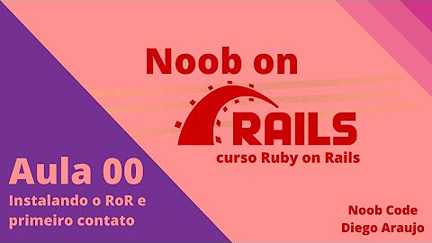

## Série de aulas sobre Ruby on Rails - NoobCode

[00 - Instalando o Ruby on Rails e Primeiro Contato](https://github.com/OsirisMariano/mini_blog/issues/1)

[01 - Primeiro CRUD - Criando Model View e Controller](https://github.com/OsirisMariano/mini_blog/issues/2)

[02 - Conhecendo os Controller](https://github.com/OsirisMariano/mini_blog/issues/3)

[03 Conhecendo os Models](https://github.com/OsirisMariano/mini_blog/issues/4)

[04 Conhecendo as Views e Rotas](https://github.com/OsirisMariano/mini_blog/issues/5)

[05 Aprofundando no MVC - A Vez do Index](https://github.com/OsirisMariano/mini_blog/issues/6)

[06 Aprofundando no MVC - A Vez do Show](https://github.com/OsirisMariano/mini_blog/issues/7)

[07 Aprofundando no MVC - A Vez do New e Create](https://github.com/OsirisMariano/mini_blog/issues/8)

[08 Aprofundando no MVC - A Vez do Edit e Update](https://github.com/OsirisMariano/mini_blog/issues/9)

[09 Aprofundando no MVC - A Vez do Destroy](https://github.com/OsirisMariano/mini_blog/issues/10)

[10 Associations - belongs_to, has_many e has_one](https://github.com/OsirisMariano/mini_blog/issues/11)

[11 Associations - has_many through](https://github.com/OsirisMariano/mini_blog/issues/12)

[12 Associations - has_one through](https://github.com/OsirisMariano/mini_blog/issues/13)

[13 Associations - has and belongs to many](https://github.com/OsirisMariano/mini_blog/issues/14)

[14 Associations - Tabelas Polimorficas](https://github.com/OsirisMariano/mini_blog/issues/15)
